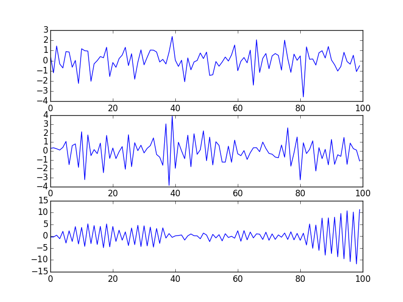

In this note I will be focusing on the state space model of type:

\begin{align}
x_t &= A x_{t-1} + \epsilon_t, \epsilon_t \sim N(0,Q), \\
y_t &= C x_t + \delta_t, \delta_t \sim N(0,R). \label{eq:obs}
\end{align}


## Forward Filtering


```{python, eval=FALSE}
import numpy as np; 
def kfilter(y, num, x0, v0, A, C, Q, R):
    x_f = np.zeros(num); v_f = np.zeros(num);
    x_p = np.zeros(num); v_p = np.zeros(num);
    x_f[-1] = x0; v_f[-1] = v0;
    for i in range(num):
        x_p[i] = A*x_f[i-1]
        v_p[i] = A*v_f[i-1]*A + Q
        K = v_p[i]*C/(C*v_p[i]*C+R)
        x_f[i] = x_p[i] + K*(y[i]-C*x_p[i])
        v_f[i] = v_p[i] - K*C*v_p[i]
    return {'x_f':x_f,'v_f':v_f,'x_p':x_p,'v_p':v_p, 'K_T':K}
```

Kalman filtering computes $\mu_t, \Sigma_t, \mu_{t|t-1}, \Sigma_{t|t-1}$:
\begin{align*}
\mu_t &= \mathrm{E}[x_t|y_{1:t}] \\
\Sigma_t &= \mathrm{E}[(x_t-\mu_t)(x_t-\mu_t)'|y_{1:t}] \\
\mu_{t|t-1} &= \mathrm{E}[x_t|y_{1:t-1}] \\
\Sigma_{t|t-1} &= \mathrm{E}[(x_t-\mu_{t|t-1})(x_t-\mu_{t|t-1})'|y_{1:t-1}].
\end{align*}

These variables are denoted by `x_f, v_f, x_p, v_p` in function `kfilter` above. Procedure for estimating these values are summarized in two following steps: *prediction* and *measurement* step.

\newpage

### Prediction
At time step $t$, assume that we have computed $\mu_{t-1},\Sigma_{t-1}$, and that the distribution is normally distributed
\begin{equation}
x_{t-1} | y_{1:t-1} \sim N(\mu_{t-1},\Sigma_{t-1}).
\end{equation}
Prediction of the state variable $x_t$ in the next step is given by:
\begin{align*}
x_{t} | y_{t-1} &\sim N(\mu_{t|t-1},\Sigma_{t|t-1}).\\
\mu_{t|t-1} &= \mathrm{E}[x_t|y_{1:t-1}],\\
            &= \mathrm{E}[A x_{t-1} + \epsilon_t |y_{1:t-1}],\\
            &= A \mathrm{E}[x_{t-1}|y_{1:t-1}],\tag{$\epsilon_t$ has mean zero} \\
            &= A \mu_{t-1}.\\
\Sigma_{t|t-1} &= \mathrm{Var}[x_t|y_{1:t-1}]\\
               &= \mathrm{Var}[A x_{t-1} + \epsilon_t|y_{1:t-1}],\\
               &= \mathrm{Var}[A x_{t-1}|y_{1:t-1}] + \mathrm{Var}[\epsilon_t|y_{1:t-1}],\tag{$\mathrm{Cov}(x_{t-1},\epsilon_t) = 0$}\\
               &= A \Sigma_{t-1} A' + Q.
\end{align*}

### Measurement

In prediction step, we have certain belief of how $x_t$ is distributed given past observation $y_1,\dots,y_{t-1}$. This can be quantitatively represented by $\mathrm{P}(x_{t} | y_{1:t-1})$, which is called *prior distribution* in the language of bayesian framework. In measurement step, a newly observed data point $y_t$ is obtained first. The *likelihood* is according to Equaiton \ref{eq:obs}:
\begin{equation}
\mathrm{P}(y_t| x_t, y_{1:t-1}) = \frac{1}{|2\pi R|^{-\frac{1}{2}}} e^{-\frac{1}{2}(y_t-C x_t)'R^{-1}(y_t-C x_t)}
\end{equation}

Conceptually, one can update distribution using bayes rule:
\begin{equation}\label{eq:bayes}
\mathrm{P}(x_t| y_t, D^{t-1}) \propto \mathrm{P}(y_t| x_t, y_{1:t-1}, D^{t-1}), \mathrm{P}(x_t| D^{t-1}) \tag{$D^{t-1} := y_{1:t-1}$},
\end{equation}
in order to obtain *posterior* $\mathrm{P}(x_t| y_{1:t})$.

Kalman filtering deals with special case of such updating rules by assuming all distribution to be normal. For this reason, two parameters $\mu_t,\Sigma_t$ which is a representative for posterior distribution at time $t$ can be computed analytically as:
\begin{align*}
\mu_t &= \mu_{t|t-1} + K_t r_t \\
\Sigma_t &= \left( \mathbb{I} - K_t C_t \right) \Sigma_{t|t-1},
\end{align*}
where,
\begin{align*}
r_t &= y_t - \mathrm{E}[y_t|y_{1:t-1}], \\
&= y_t - \mathrm{E}[C x_t + \delta_t |y_{1:t-1}], \\
&= y_t - C \mu_{t|t-1}, \\
K_t &= \Sigma_{t|t-1} C' (C\Sigma_{t|t-1}C'+R)^{-1}.
\end{align*}

## Backward Smoothing

```{python, eval=FALSE}
def ksmooth(y, num, x_f, v_f, x_p, v_p, A, vvT):
    x_s = np.zeros(num); v_s = np.zeros(num); J = np.zeros(num-1); P = np.zeros(num)
    x_s[num-1] = x_f[num-1]; v_s[num-1] = v_f[num-1]
    P[num-1] =  v_s[num-1] + x_s[num-1]*x_s[num-1]
    for i in range(1,num)[::-1]:
        J[i-1] = v_f[i-1]*A/v_p[i]
        x_s[i-1] = x_f[i-1] + J[i-1]*(x_s[i]-x_p[i])
        v_s[i-1] = v_f[i-1] + J[i-1]*(v_s[i]-v_p[i])*J[i-1]
        P[i-1] =  v_s[i-1] + x_s[i-1]*x_s[i-1]
    PP = np.zeros(num-1); vv = np.zeros(num-1)
    vv[num-2] = vvT; PP[num-2] = vv[num-2] + x_s[num-1]*x_s[num-2]
    for i in range(2,num)[::-1]:
        vv[i-2] = v_f[i-1]*J[i-2] + J[i-1]*(vv[i-1]-A*v_f[i-1])*J[i-2]
        PP[i-2] = vv[i-2] + x_s[i-1]*x_s[i-2]
    return {'x_s':x_s,'v_s':v_s,'J':J,'P':P,'PP':PP}
```

By alternating between prediction and measurement steps, kalman filtering computes the distribution of $x_t|y_{1:t}$ forwards in time. Once computation at final time point $t=T$ is finished, we can work backwards by using *kalman smoothing* algorithm. The goal of this algorithm is to compute distribution $\mathrm{P}(z_t|y_{1:T})$ by also incorporating future data $y_{t+1:T}$ in additional to $y_{1:t}$. Specifically, the backwards smoothing algorithm computes $\mu_{t|T},\Sigma_{t|T}$ for which the following holds true: $$z_t|y_{1:T} \sim N(\mu_{t|T},\Sigma_{t|T})$$.

### Conditional Distribution for MVN
Before going into the derivation details of this procedure, let recall an elementary result from multivariate normal distribution. Let $X = (X_1,X_2)'$ be jointly distributed normal random variable with
$$
 \mathrm{E}[X]=\begin{bmatrix}
         \mu_1 \\
         \mu_2 \\
  \end{bmatrix},
  \mathrm{Var}[X]=\begin{bmatrix}
         \Sigma_{11}  & \Sigma_{12}\\
         \Sigma_{21}  & \Sigma_{22}\\
  \end{bmatrix}
$$.

Then,
\begin{equation}\label{eq:jointcond}
X_1|X_2 \sim N(\mu_1+\Sigma_{12}\Sigma_{22}^{-1}(X_2-\mu_2),\Sigma_{11}-\Sigma_{12}\Sigma_{22}^{-1}\Sigma_{21}).
\end{equation}

Also, it is not hard to work out the joint distribution:
$$
(x_t,x_{t+1}) | y_{1:t} \sim N\left(
\begin{bmatrix}
         \mu_{t} \\
         \mu_{t+1|t} \\
  \end{bmatrix},
  \begin{bmatrix}
         \Sigma_{t}  & \Sigma_{t} A'\\
         A \Sigma_{t}  & \Sigma_{t+1|t}\\
  \end{bmatrix}
\right).
$$

Then, applying (\ref{eq:jointcond}) to obtain:
\begin{align}\label{eq:condep}
x_t| x_{t+1}, y_{1:t} &\sim N(\mu_t+\Sigma_{t} A'\Sigma_{t+1|t}^{-1}(x_{t+1}-\mu_{t+1|t}),\Sigma_{t}-\Sigma_{t} A'\Sigma_{t+1|t}^{-1}A \Sigma_{t}), \notag \\
&\sim N(\mu_t+J_t(x_{t+1}-\mu_{t+1|t}),\Sigma_{t}-J_t\Sigma_{t+1|t}J_t'),\\
J_t &:= \Sigma_{t} A'\Sigma_{t+1|t}^{-1}. \notag
\end{align}

### Calculating $\mu_{t|T}$

\begin{align}
\mu_{t|T} &= \mathrm{E}[x_t|y_{1:T}] \label{eq:musmooth} \\
&= \mathrm{E}[\mathrm{E}[x_t| x_{t+1}, y_{1:T}] |y_{1:T}] \label{eq:iter}\\
&= \mathrm{E}[\mathrm{E}[x_t| x_{t+1}, y_{1:t}] |y_{1:T}] \label{eq:coindept}\\
&= \mathrm{E}[\mu_t+J_t(x_{t+1}-\mu_{t+1|t}) | y_{1:T}] \label{eq:condep1}\\
&= \mu_t+J_t(\mathrm{E}[x_{t+1}|y_{1:T}]-\mu_{t+1|t}) \\
&= \mu_t+J_t(\mu_{t+1|T}-\mu_{t+1|t}).
\end{align}

We reach from \eqref{eq:musmooth} to \eqref{eq:iter} by using *law of iterated expectation*. Transition to line \ref{eq:coindept} involves property called *conditional independent* which true by state space model assumption. One intuitive way to understand why $y_{1:T}$ changes to $y_{1:t}$ is that $x_{t+1}$ already contains all the information about dependency between $x_t$ and $y_{t+1:T}$, so  $y_{t+1:T}$ is nolonger affecting probability of $x_t$ once $x_{t+1}$ is given.

By applying \eqref{eq:condep}, we obtain \eqref{eq:condep1}

$\Sigma_{t|T}$ can be derived similarly using law of iterated variance.

### Local level model

I apply above three method: prediction, measurement (or filtering) and smoothing to local level model to see how well they can track this time serie:
\begin{align*}
x_t &= x_{t-1} + \epsilon_t, \epsilon_t \sim N(0,1) \\
y_t &= x_t + \delta_t, \delta_t \sim N(0,1) \label{eq:obs}
\end{align*}

As expected, kalman filtering `x_f` track the observation better than `x_p` from prediction step. `x_s` looks smooth the most and has lowest variance `v_s` among three method.

```{r, engine='python', eval=FALSE}
import matplotlib.pyplot as plt
num = 50; x0 = 0; v0 = 1; A=1; C=1; Q=1; R=1;
w = np.random.normal(x0,Q,num+1); v = np.random.normal(0,R,num);
mu = np.cumsum(w);
y = mu[1:] + v;
t = np.arange(num)

ans1 = kfilter(y, num, x0, v0, A, C, Q, R)
x_f = ans1['x_f']; v_f = ans1['v_f']; x_p = ans1['x_p']; v_p = ans1['v_p']; K_T = ans1['K_T'];
ans2 = ksmooth(y, num, x_f, v_f, x_p, v_p, A, (1-K_T*C)*A*v_f[num-2]);

plt.figure(2)
plt.subplot(311)
plt.plot(t,mu[1:],'bo',t,ans1['x_p'],'k')
plt.plot(t,ans1['x_p']+2*np.sqrt(ans1['v_p']),'--r');
plt.plot(t,ans1['x_p']-2*np.sqrt(ans1['v_p']),'--r');
plt.subplot(312)
plt.plot(t,mu[1:],'bo',t,ans1['x_f'], 'k')
plt.plot(t,ans1['x_f']+2*np.sqrt(ans1['v_f']),'--r');
plt.plot(t,ans1['x_f']-2*np.sqrt(ans1['v_f']),'--r');
plt.subplot(313)
plt.plot(t,mu[1:],'bo',t,ans2['x_s'], 'k')
plt.plot(t,ans2['x_s']+2*np.sqrt(ans2['v_s']),'--r');
plt.plot(t,ans2['x_s']-2*np.sqrt(ans2['v_s']),'--r');
```

  

\newpage

## Parameter Learning

```{python, eval=FALSE}
def klearn(y, num, x0, v0, A, C, Q, R):
    while True:
        flt = kfilter(y, num, x0, v0, A, C, Q, R)
        x_f = flt['x_f']; v_f = flt['v_f']
        x_p = flt['x_p']; v_p = flt['v_p']; K_T = flt['K_T']
        sm = ksmooth(y, num, x_f, v_f, x_p, v_p, A, (1-K_T*C)*A*v_f[num-2])
        x_s = sm['x_s']; P = sm['P']; PP = sm['PP']
        C = np.sum(y*x_s) / sum(P)
        Q = 1 # eps is normalized
        R = np.sum(y*y-C*x_s*y) / num
        A = np.sum(PP) / np.sum(P[:-1])
        x0 = x_s[0]
        v0 = P[0] - x_s[0]*x_s[0]
        yield x0, v0, A, C, Q, R
```

In this section, I write an EM algorithm for estimation of $\theta = (\mu_0, \Sigma_0, A, C, Q, R)$. One remark is that because the state variable $x_t$ cannot be observed. We can always scales it up and down and have another valid model. For example, we could say that our model is:
\begin{align*}
x_t &= A x_{t-1} + \epsilon_t, \epsilon_t \sim N(0,Q) \\
y_t &= C x_t + \delta_t, \delta_t \sim N(0,R), 
\end{align*}
or equally valid, it is 
\begin{align*}
x_t &= A x_{t-1} + \epsilon_t, \epsilon_t \sim N(0,2Q) \\
y_t &= \frac{C}{2} x_t + \delta_t, \delta_t \sim N(0,R), 
\end{align*}
which is obtained by replacing $x_t$ with $2x_t$. For this reason, it is safe to let the state equation variance remain constant with $Q=1$. In other word, $\epsilon_t$ is normalized so it follow standard normal distribution.


### AR(1) Model with Observation Noise.

In this section I generate AR(1) model with observation noise:
\begin{align*}
x_t &= \phi x_{t-1} + \epsilon_t, \epsilon_t \sim N(0,Q) \\
y_t &= x_t + \delta_t, \delta_t \sim N(0,R).
\end{align*}

My goal is to see how well `klearn` function can recover the values of $\phi$, when we try to estimate it from noisy $y_t$. Below are three auto-regressive series generated with three different auto-regressive coefficient $\phi = -0.01, -0.7, -0.99$. 


```{python,eval=FALSE}
from statsmodels.tsa.arima_process import arma_generate_sample, ArmaProcess
plt.figure(3)
series = [];
phiList = [-0.01,-0.7,-0.99]
np.random.seed(1234);
for i, phi in enumerate(phiList):
    arparams = np.array([1, -phi])
    maparams = np.array([1])
    arma_t = ArmaProcess(arparams, maparams)
    series.append(arma_t.generate_sample(nsample=100,scale=1))
    plt.subplot(311+i)
    plt.plot(series[i])
plt.show()
```



I then add noise to those three generated series by before estimating model parameters. The magnitude of noise varies from as low as $\sigma = 0.01$ up to around $\sigma = 1.5$. It can be seen below that model with $\phi=0.01$ is the hardest to estimated with accuracy. As $\phi$ is estimated to be `phi1=-0.328` even when the magnitude of noise is low (`noise=0.11`). At this noise level, estimated $\hat{\phi}$ in the second and third is close to its true value as can be seen from `phi2=-0.691, phi3=-1.011`, which quite close to $\phi=-0.7,-0.99$.

As the level of noise is grows higher, estimated $\phi$ for the second model starts to deviate more from $\phi=-0.7$. This can be contrast to the estimation for third model which is quite robust.

```{python, eval=FALSE}
estIndexbyNoise = []
nList = np.arange(0.01,1.5,0.1)
initpars = np.array([0,1,1,1,1,1]) # initial values of x0, v0, A, C, Q, R
np.random.seed(1234);
for i, noise in enumerate(nList):
    est = []
    for j in range(3):
        learn = klearn(series[j]+np.random.normal(0,noise,100), 100, *initpars)
        for k in range(500):
            learn.next()
        _, _, phi, _, _, _ = learn.next()
        est.append(phi)
    estIndexbyNoise.append(est)
    if i%2 != 0:
        print 'noise={0}  phi1={1:6.3f}, phi2={2:6.3f}, phi3={3:6.3f} \n'.format(noise, *est)
```

```{python, echo=FALSE}
with open('console.txt','r') as txt:
    print txt.read()
```


